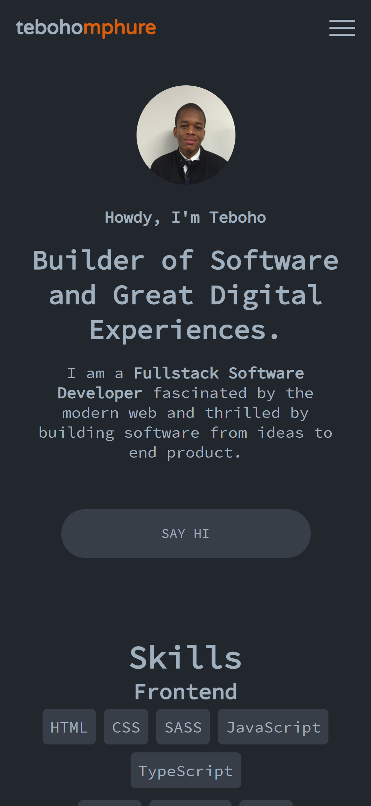

Our running club is planning to host a race named the Isaac Mabula Challenge and I noticed that it does not have a website so I decided to create a simplistic single page website for the race.

### Tech

I chose the simplest tech stack for this website because it does not do anything complicated. All it does is serve static content and it also have a form which a visitor can fill out and the data is stored in a NoSQL database.

The stack I used is

1. Javascript
1. Tailwind
1. Netlify Functions
1. Firebase

The backend calls are handled by a netlify function which is a serverless funciton which talks to the firebase database.

### Why I chose this stack

I chose this stack because I didn't want to use frameworks and write a backend api for handling the client side calls.

My website before the update.

My website after the update.

The changes I made to the new website are as follows.

1. **Booting out bootstrap**
1. **Added blog functionality**
1. **Light mode and dark mode themes**
1. **Simplified design**

My reasons for the above are as follows

### Booting out bootstrap

On the old website I was using bootstrap, particularly it's grid system and the mobile first navbar. I feel like the parts of bootstrap I was using on the site were too small to justify adding an entire bootsrap library on this new site, so I rather rewrote the parts I used by using plain css.

### Added blog functionality

On the new website I also wanted to add a blog, so I chose [gatsby js](https://www.gatsbyjs.com/) in order to do that. The website was previously a plain JS, HTML & CSS project.

### Light mode and dark mode themes

I have added a light and a dark theme, the website will adapt and match the theme you are using on your device (computer or mobile).

### Simplified design

I'm not a design expert but on this new website I tried to use less fonts and I decided to drop the background imagery I was using.

That's all for now see you on the next post.
