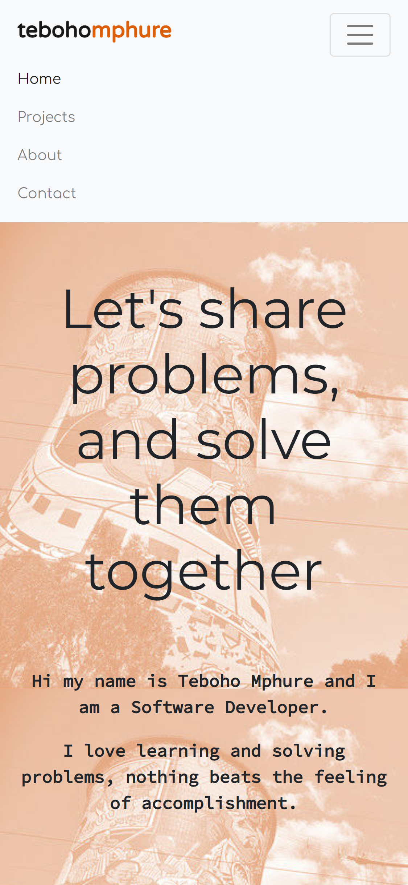
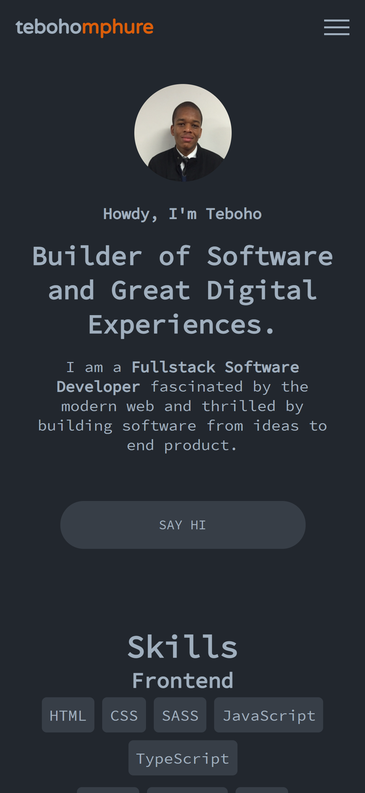

After a few years of my personal website's existence I decided it was time to give it an update and I went ahead and did that.

This is how the website looked before and after the update.

My website before the update.

My website after the update.

The changes I made to the new website are as follows.

1. **Booting out bootstrap**
1. **Added blog functionality** 
1. **Light mode and dark mode themes**
1. **Simplified design**

My reasons for the above are as follows

### Booting out bootstrap

On the old website I was using bootstrap, particularly it's grid system and the mobile first navbar. I feel like the parts of bootstrap I was using on the site were too small to justify adding an entire bootsrap library on this new site, so I rather rewrote the parts I used by using plain css.

### Added blog functionality 

On the new website I also wanted to add a blog, so I chose [gatsby js](https://www.gatsbyjs.com/) in order to do that. The website was previously a plain JS, HTML & CSS project.

### Light mode and dark mode themes 

I have added a light and a dark theme, the website will adapt and match the theme you are using on your device (computer or mobile).

### Simplified design 

I'm not a design expert but on this new website I tried to use less font and I decided to drop the background imagery I was using.

That's all for now see you on the next post.

